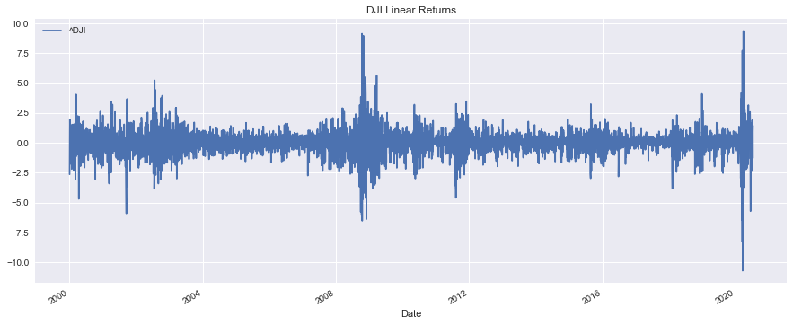
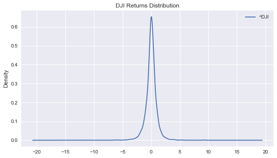
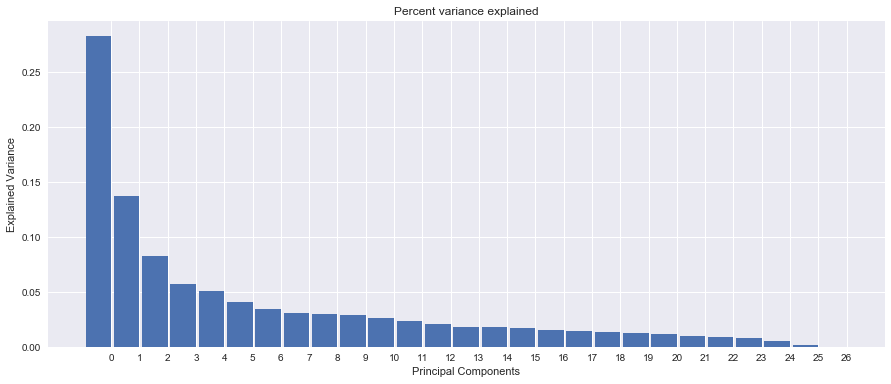
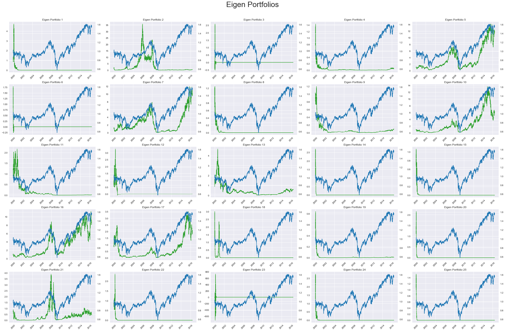
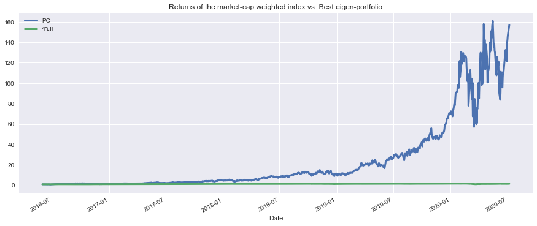
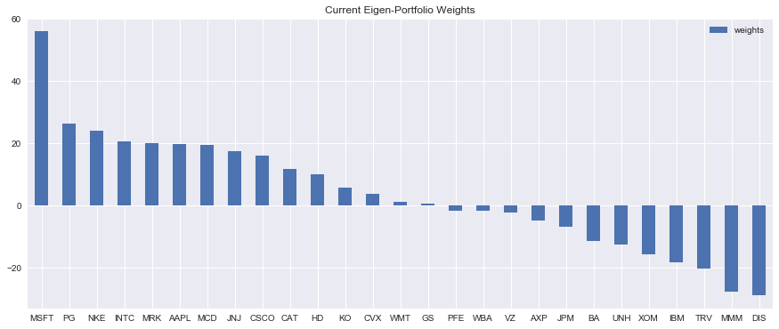
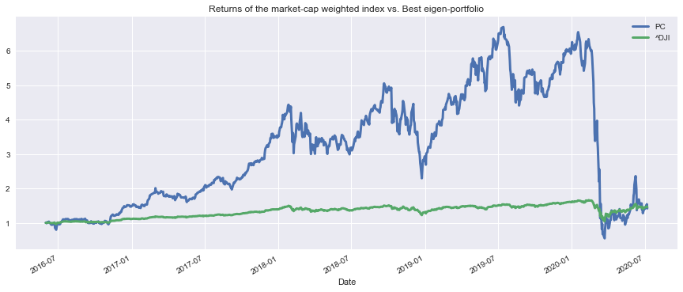
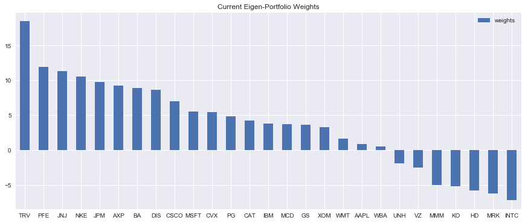

# Eigen Portfolios
After finishing MIT 18.06 on Linear Algebra, I wanted to put my new found knowledge to good use. I knew about the traditional approach of Markowitz mean-variance optimization, but I was curious to explore other approaches. This led me to attempt eigen decomposition/PCA on the basket of stocks contained within popular indices like DJI to create an optimized portfolio. The timeframe I will be using will be from 2000 onwards.  

You can find my full workings at [Eigen-Portfolio.ipynb](Eigen-Portfolio.ipynb) and my scraping script that I wrote to get the price history of tickers within an index at [index_ticker_scraper.py](index_ticker_scraper.py).

### Basic Visualisations

  
We can observe here that returns may appear to follow a normal distribution but tend to have fatter tails.

### Eigen Decomposition/PCA

  We see the decay happening quickly with the first few principal components explaining majority of the variance.   
  
This gives us a quick overview on all the principal components relative to DJI's overall price movement, with each principal component explaining a particular factor of the market. I am curious if there is way to identify the value and momentum factor.

## Results 
### Best Portfolio Performance (fitted to test set)

  

### Best Portfolio Performance (not fitted to test set)

  

### Observations
It appears to perform badly out of sample, but with a good stop loss in place, it could work. However, I've learnt that backtesting is never a true positive and instead it will only flag out false positives. Hence, I would take these findings with a pinch of salt. The best way going forward personally will be to fully understand what an eigenvalue decomposition is truly doing to a covariance matrix and further investigate the stability of these eigenvectors. I suppose once that is done and if the underlying theory is sound, then the backtest results can now be regarded as a true positive, as it is now coupled together with a theory. :smile:  

I hope this has been as interesting for you as it has been for me! Till the next project. 

## Resources required to replicate the findings
1. A dataframe containing prices of tickers that interest you. (feel free to use my scraping script)
2. Some understanding on Linear Algebra.

## Credits (Resources I've read that have deeply helped!)
1. https://www.youtube.com/watch?v=7UJ4CFRGd-U&list=PLE7DDD91010BC51F8 (Gilbert Strang's 18.06 - He is an insanely good teacher of Linear Algebra)
2. https://github.com/alexdai186/Eigenportfolios
3. https://srome.github.io/Eigenvesting-I-Linear-Algebra-Can-Help-You-Choose-Your-Stock-Portfolio/
4. https://github.com/Gustrigos/Eigen-Portfolio/blob/master/ml.ipynb 

## Disclaimer
All views and findings presented in my code or repository are my own and do not represent the opinions of any entity whatsoever with which I have been, am now, or will be affiliated. All material provided are for general information purposes only and do not constitute accounting, legal, tax, or other professional advice. Visitors should not act upon the content or information found here without first seeking appropriate advice from an accountant, financial planner, lawyer or other professional. Usage of any material contained within this repository constitutes an explicit understanding and acceptance of the terms of this disclaimer. 
