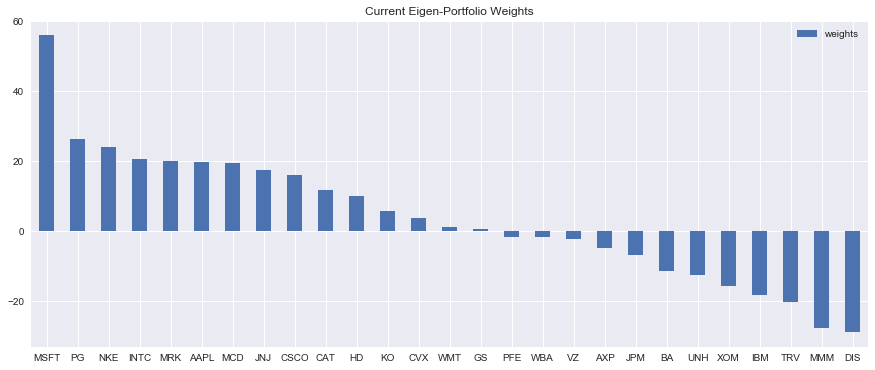

# Eigen Portfolios
After finishing MIT 18.06 on Linear Algebra, I wanted to put my new found knowledge to good use. I knew about the traditional approach of Markovitz mean-variance optimization, but I was curious to explore other approaches. This led me to attempt Eigen decomposition on the basket of stocks contained within popular indices like DJI to create an optimized portfolio. 

### Basic Visualisations

### Eigen Decomposition

## Results 
#### Best Portfolio Performance

## Resources required to replicate findings
A dataframe containing prices of tickers that interest you.

## Disclaimer
All views and findings presented in my code or repository are my own and do not represent the opinions of any entity whatsoever with which I have been, am now, or will be affiliated. All material provided are for general information purposes only and do not constitute accounting, legal, tax, or other professional advice. Visitors should not act upon the content or information found here without first seeking appropriate advice from an accountant, financial planner, lawyer or other professional. Usage of any material contained within this repository constitutes an explicit understanding and acceptance of the terms of this disclaimer. 
